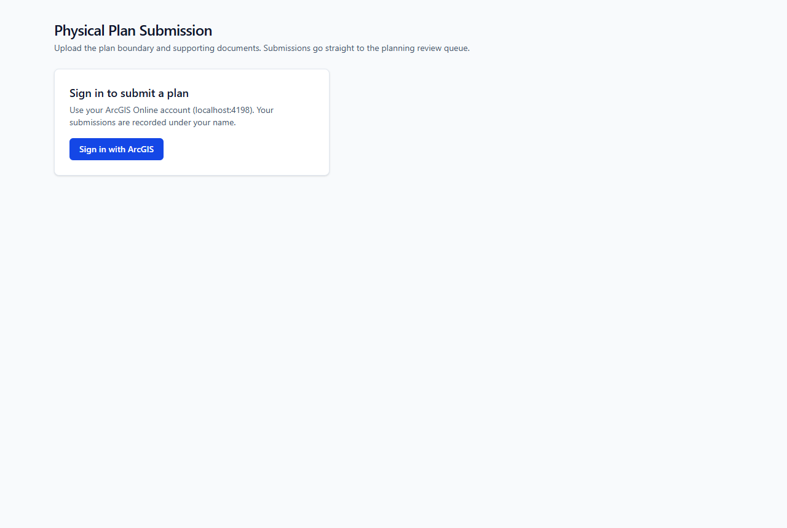
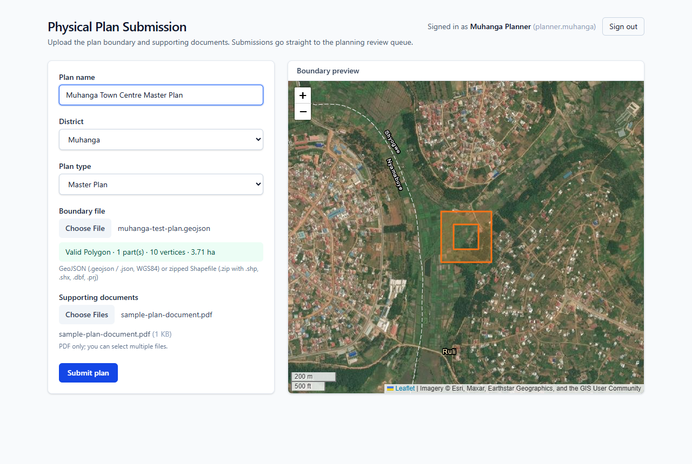
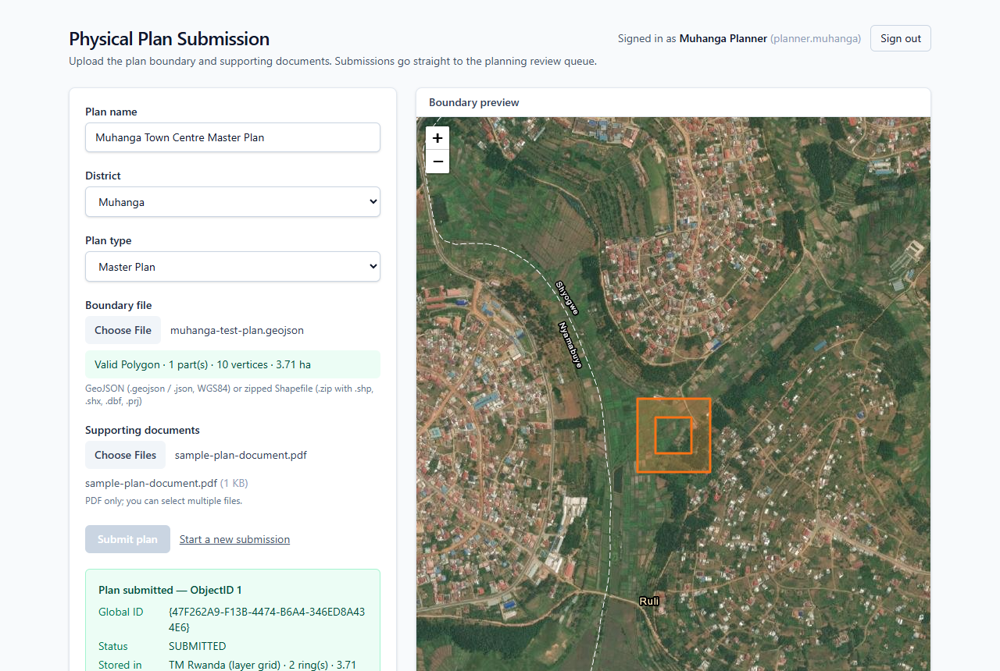
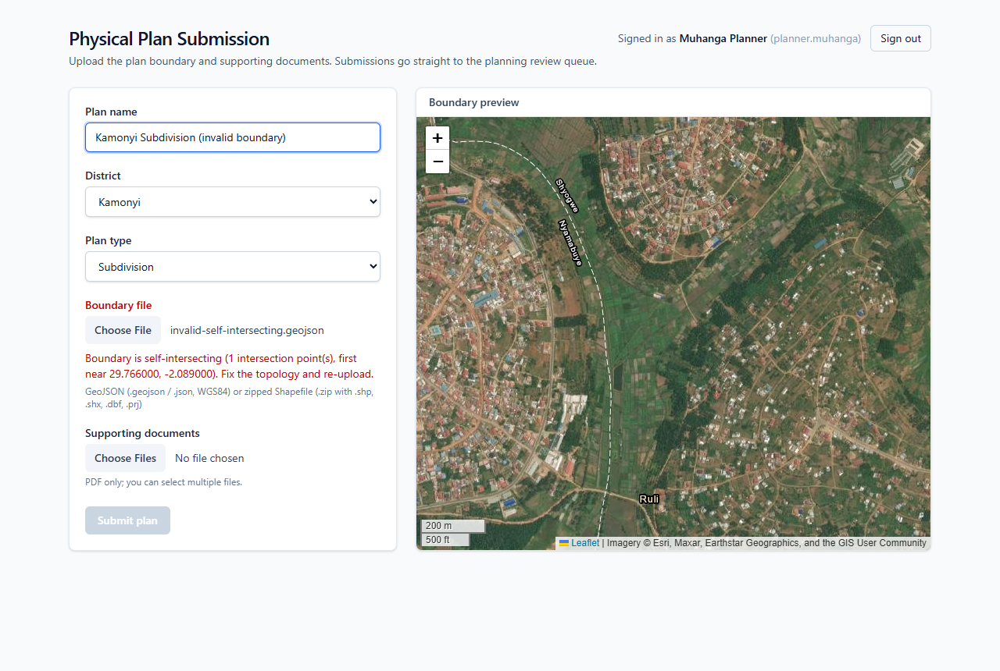
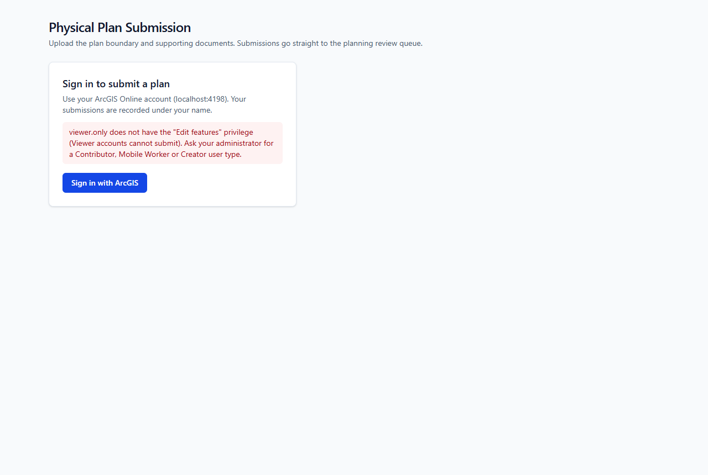
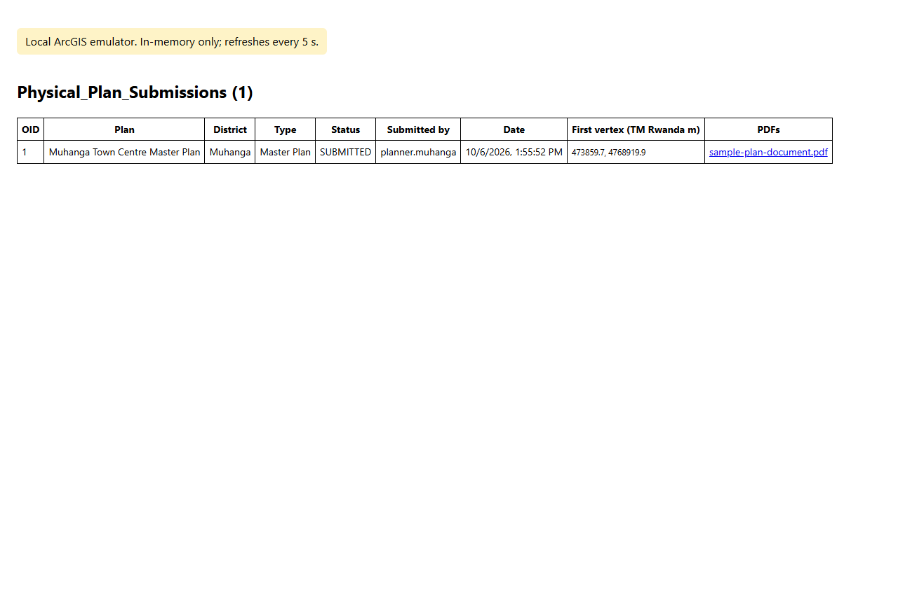

# Physical Plan Intake: NLA

Web intake for physical plan submissions. Planners sign in with their **ArcGIS Online** account, upload a plan boundary (GeoJSON or zipped Shapefile) and supporting PDFs. The app validates the geometry, projects it into the layer's national grid (TM Rwanda / ITRF2005) and writes the feature and its attachments straight into a hosted feature layer. Reviewers see it in **ArcGIS Experience Builder** within seconds, with no manual publishing.

[](https://github.com/devopsgeospatial/nla-physical-plans-intake/actions/workflows/ci.yml)

| Sign in (each planner uses their own ArcGIS account) | Boundary preview on imagery before submitting |
|---|---|
|  |  |
| **Submitted: stored in the TM Rwanda grid with its PDF** | **Invalid geometry is rejected with a precise reason** |
|  |  |
| **Accounts without edit rights are refused at sign-in** | **The stored record, submitter and PDF** |
|  |  |

The screenshots are generated by `npm run screenshots` from the production build, running against the local ArcGIS emulator (see [Testing](#testing)).

## How it works

```
Browser ──(OAuth 2.0 + PKCE)──▶ ArcGIS Online sign-in (SSO/MFA supported)
   │
   │ multipart: fields + boundary + PDFs
   ▼
Next.js API route  /api/plans/submit          (runs with the signed-in user's token)
   ├─ re-validates everything server-side (client preview is advisory only)
   ├─ GeoJSON / zipped Shapefile → WGS84 → layer grid (proj4, from the layer's own WKT)
   ├─ POST …/FeatureServer/0/applyEdits        → objectId
   ├─ POST …/FeatureServer/0/{objectId}/addAttachment   (each PDF)
   └─ on attachment failure: deletes the feature again (no half-created plans)
```

* **Identity:** no shared service account. ArcGIS Online records who submitted each plan through editor tracking. Tokens stay server-side in an AES-256-GCM encrypted, httpOnly cookie.
* **Access:** optional group restriction (`ARCGIS_ALLOWED_GROUP_ID`). Viewer accounts are refused with an explanation.
* **Validation:** polygon-only, closed rings, no self-intersections, coordinate-system detection, PDF signature check, size and count limits, district and plan-type allow-lists matching the layer's coded-value domains.
* **Projection:** WGS84 and Web Mercator are handled natively. Any layer defined by WKT (the NLA layers use a custom TM Rwanda grid) goes through proj4. Anything else goes through the ArcGIS geometry service.

| Path | What |
|---|---|
| `app/api/plans/submit/route.ts` | Intake endpoint |
| `app/api/auth/*` | OAuth sign-in, callback, sign-out |
| `app/api/setup/layer/route.ts` | One-time creation of the intake layer by a signed-in publisher |
| `lib/geo/` | Boundary parsing/validation, Esri ring orientation, projection |
| `lib/arcgis/` | Typed ArcGIS REST client, layer provisioning |
| `lib/plan-options.ts` | Districts (Rwanda's 30), plan types, statuses, field names |
| `docs/EXPERIENCE_BUILDER_SETUP.md` | ArcGIS Online + Experience Builder configuration guide |
| `scripts/dev/` | Local ArcGIS emulator, screenshot tool (development only) |

## Run it

Requires Node.js 20.9+ (CI uses 24).

```bash
npm install
```

**Locally, without ArcGIS** (an emulator stands in for ArcGIS Online; data is in memory):

```bash
npm run dev:local        # app http://localhost:3000, stored records http://localhost:4100
```

**Against ArcGIS Online:**

1. Register the app: in ArcGIS Online go to **Content → New item → Developer credentials → OAuth 2.0 credentials**, with redirect URL `http://localhost:3000/api/auth/callback`.
2. Copy `.env.example` to `.env.local`. Set `ARCGIS_OAUTH_CLIENT_ID`, and set `SESSION_SECRET` to 32+ random characters.
3. Run `npm run dev` and sign in. If the intake layer doesn't exist yet, a publisher can create it from the app with one click.

Then follow [`docs/EXPERIENCE_BUILDER_SETUP.md`](docs/EXPERIENCE_BUILDER_SETUP.md) to set up the review app.

## Testing

```bash
npm run typecheck
npm test            # unit: GeoJSON + zipped Shapefile parsing, validation, ring orientation, TM Rwanda projection
npm run test:e2e    # production build vs ArcGIS emulator: sign-in (PKCE), access refusal, submission + PDF, validation, sign-out
npm run screenshots # regenerates docs/screenshots (needs Microsoft Edge or Chrome installed)
```

CI runs the type check, unit tests and end-to-end tests on every push.

## Status

Working and tested end to end against the emulator. Not yet verified against the live NLA ArcGIS Online organization. Open items before production use:

- [ ] Register the OAuth app in the NLA org, then run the first real submission
- [ ] Enforce permissions in ArcGIS: an intake view (add only, own features) and a review view (status/comments only)
- [ ] Ownership: the intake layer is owned by an NLA institutional account, not an individual
- [ ] Hosting decision, HTTPS deployment, secrets management, logging and monitoring
- [ ] Rate limiting, security headers, malware scanning of uploaded PDFs
- [ ] Field model aligned with NLA's plan schema (plan_id, parcel UPI, zoning, …)
- [ ] Interface languages (Kinyarwanda / English / French)
- [ ] Restrict anonymous editing on the existing public `Physical_Plans` layer
